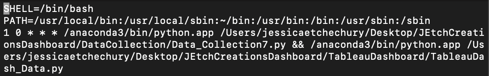
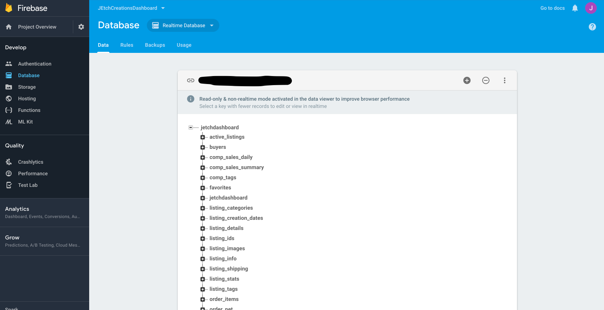
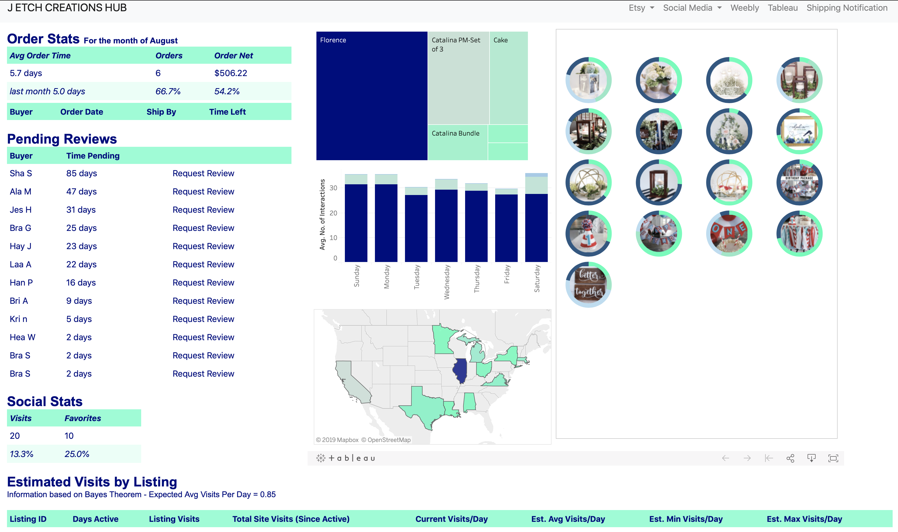
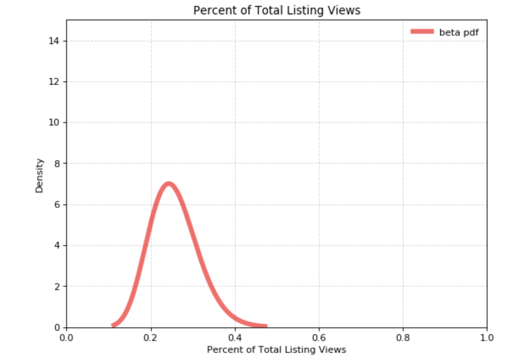
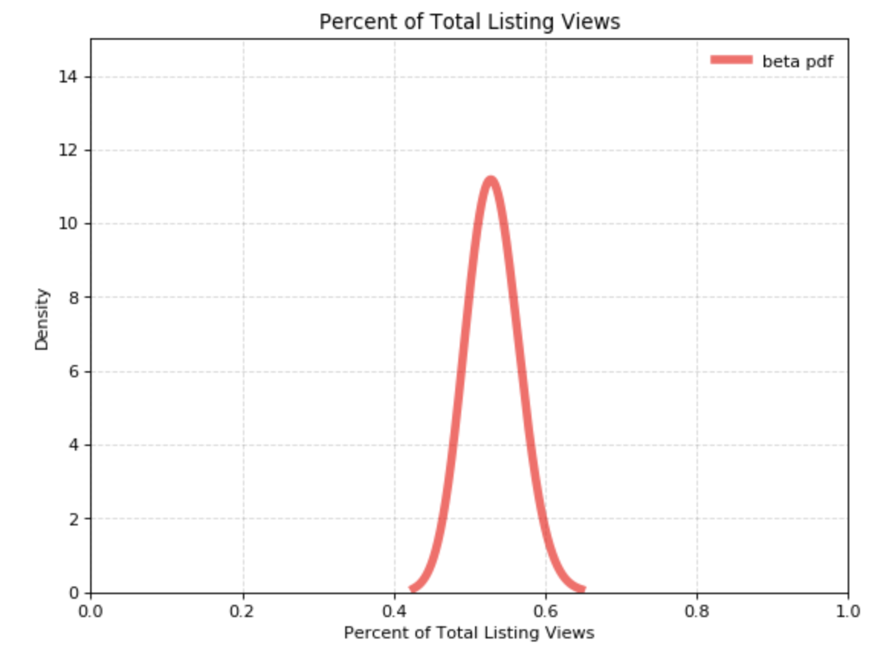
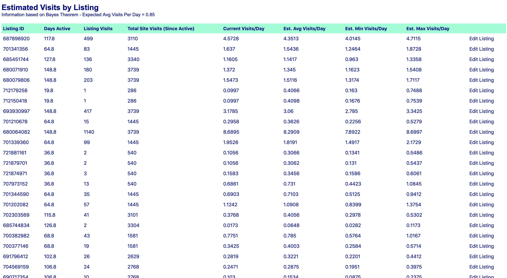
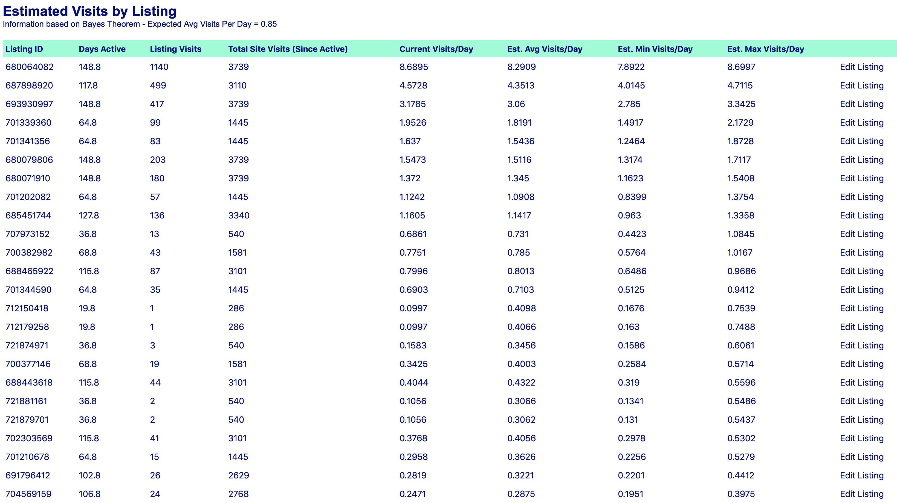
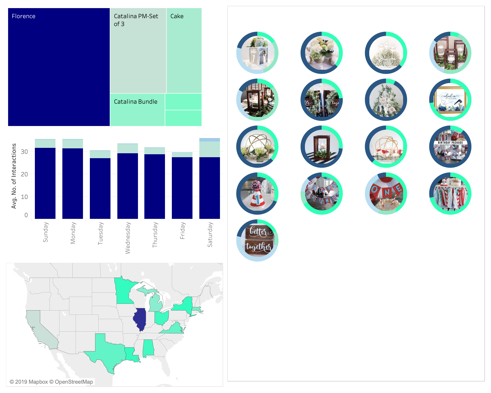
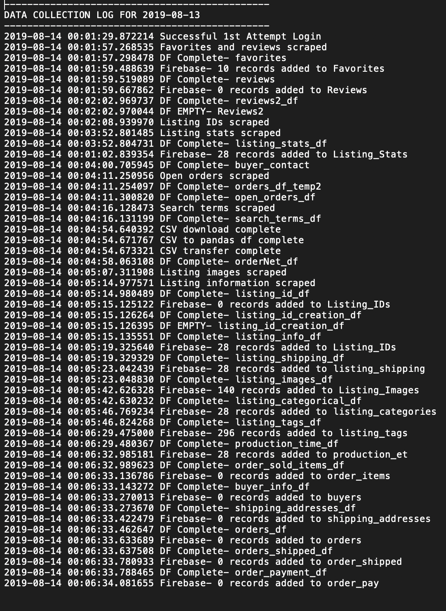

# ETSY DASHBOARD

## Objective
This project was created to streamline the day to day procedures of an Etsy shop owner.  The primary goal was to make the following daily tasks more efficient:
* Monitoring, maintaining, and adding product listings
* Processing orders
* Following up with customers regarding orders

## Data

### Collection
The first step was to identify which information was the most pertinent for day to day operations of the Etsy shop. identified the scraping code was written using Python.  Selenium and Beautiful Soup were the primary tools used to extract the data from the shop manager section of the Etsy website.    The following data was collected from the shop manager: reviews, favorites, listing IDs, active listing IDs, listing stats (visits, revenue, number sold), open orders (order time, ship by date, buyer information), and search terms. In addition to pulling information directly from the website, Selenium was used to download csv files that contained information regarding items sold, orders, and payments. Lastly, the Etsy API was used to gather listing image urls and additional information about each product listing such as it's title, category, quantity, and much more.

#### View Data Collection Scrape Script - https://github.com/jetchechury/JEtchCreationsDashboard/blob/master/DataCollection/Data_Collection7.py

In order to acquire a larger data set, an initial scrape was conducted to gather historical data for each listing.  This was accomplished by determining the listing's creation date, creating a date range, and developing a script to scrape the available information within the specified date range. 

#### View Historical Scrape Script - https://github.com/jetchechury/JEtchCreationsDashboard/blob/master/DataCollection/DataCollection_ScrapeHistoricalData.ipynb

The data collection scrape script was run daily to collected and update data.  In order to automate this process and ensure that the data was being collected as close to the same time as possible each day, a cron job was setup to run the data collection script at 12:01 each day.

## Database

Initally the data that was collected was stored in a relational MySQL database.  Several tables were created to store the data, and primary keys and foregin keys were identified to establish relationships between tables.  
However, during the creation of the dashboard's front end the need for a server to host the site and database arose.  Rather than host the data locally in a MySQL database, the data was transfered to Google Firebase.  The data collection python script was updated to reflect to the changes.  As a backup, the data collected is not only stored on Firebase, but also stored in text files locally.  

## Dashboard

### Endpoints
The shop dashboard was created using a flask application with the following endpoints:
* /open_orders - json list of orders that have not yet been shipped
* /order_stats - json list of statistics for orders (compares current month's statistics to the previous month's)
* /list_stats - json list of statistics for listings (compares current week's visits and favorites to the previous week's)
* /pending_reviews - json list of orders that are less than 100 days old that have not left a review 
* /bayes - json list of calculations using Bayes Theorem

#### View Endpoint Scripts - https://github.com/jetchechury/JEtchCreationsDashboard/tree/master/AppEndpoints

### Tables
The dashboard features tables created using Java Script and d3.  The tables display the information from the endpoints in a viewer friendly format.  In addition to information, the orders and pending reviews section of the dashboard include hrefs that allow the user to navigate directly to the order referenced.

### Bayes Theoem
The Bayes Theroem analysis table is based on the calculated averages of 28.5 site visits per day and 0.85 listing visits per day.  The prior was set at seven days or one week. The posterior Alpha and Beta were calculated and a random sample of 1000 values were used to calculated the expected minimum (25% confidence interval), maximum (95% confidence interval) and average views per day.  

For example, listing ID 707973152 has accummulated 13 visits and is has been active for 37 days.  Since this listing has been created, the site has recieved 540 visits.  Given this information, it can be expected that this listing will receive a minimum of 0.4 visits per day, a maximum of 1.09 visits per day and an average of 0.7 visits per day.

Listing ID 680079806 has accumulated 203 visits and has been active for 149 days.  Since the this listing has been created, the site has received 3739 visits.  Given this information, it can be expected that this listing will receive a minimum of 1.3 visits per day, a maximum of 1.7 visits per day and an average of 1.5 visits per day.

As seen when comparing the two graphs, the more days a listing is active the more confident one can be in the true number of visits per day.  This information can be used to see which listings are doing well and which ones are not. The ability to sort the Bayes table allows the user to view their listings in order of expected visits per day and make adjustments as needed.

### Tableau Dashboard
A dynamic Tableau dashboard was embeded to provide the user with additional information and visuals.  The information presented in the Tableau dashboard is powered via Google Sheets.  A script is run daily to extract information from the Firebase database.  That information is then written to a Google sheet workbook using [pygsheets](https://github.com/nithinmurali/pygsheets).  In turn, the Tableau dashboard which is connected to the workbook is also updated.

## Challenges

### Time
[Pythonanywhere](https://www.pythonanywhere.com) was used to host the dashboard.  The Pythonanywhere site is based on UTC time.  This created a problem for several of the endpoints used in the application.  Innacurate information was returned because of the time difference.  In order to overcome this issue, [Pytz](https://github.com/newvem/pytz) was used to localize datetime.now() which was saved to a variable.  Other time variables such as shipByDate were also localized and additional time was added to ensure that the date was equivalent to the one extracted from the database.  

### Website Changes
During the development phase of the dashboard there was a change made to the activity panel of the Etsy site.  Due to this change the data collection scrape code no longer performed as expected.  To account for future changes in the site and to monitor the performance of the data collection code, the code was altered to include several checkpoints at which the status of the data collection is logged to text file.

These logs are helpfully in quickly identifying any flaws within the code.  In addition to the various checkpoints, several try/except statements were used to prevent the code from "breaking" completely.  By using the try/except statements, if a part of the code is unable to run the code following it will still have the opportunity to be run.

## Future Explorations

The following features would further enhance the dashboard:
* To do list associated with each order - This feature would provide the seller with a list of materials and a to do list with projected time to complete each step for each item in an order.
* Send coupons to reviewers - An incentive for customers to leave a review is a coupon.  Being able to automate this process using the data already collected would streamline the process and ensure that coupons are being distributed and monitored efficiently.  
* Send status updates to customers - Creating an open dialouge helps to ensure customer satisfaction.  One way to do this is by keeping the customer informed as their order moves through the production process.  Through the establishment of several production checkpoints (i.e. order review, order confirmation, pre-production, production, packaging, etc.) and employing a tracking system updates could be made possible.